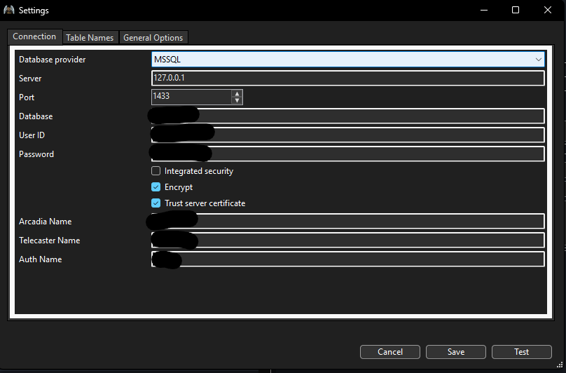
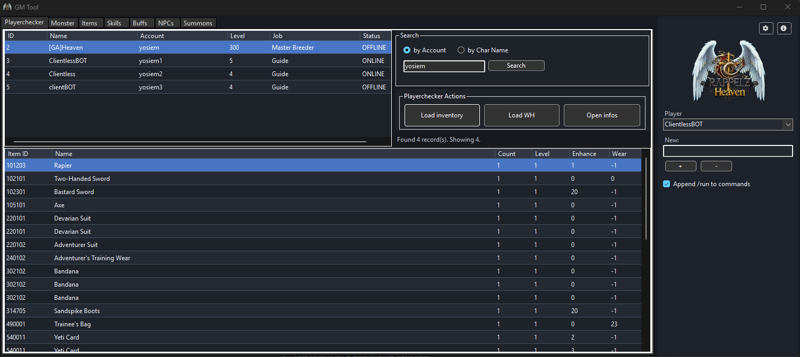
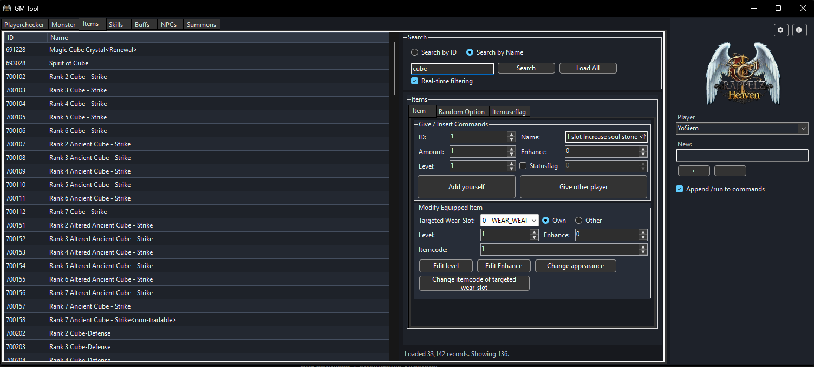
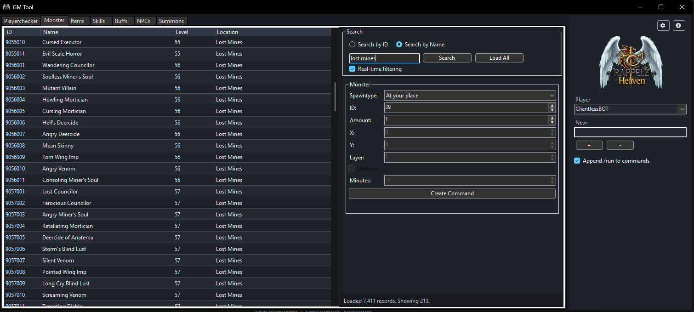
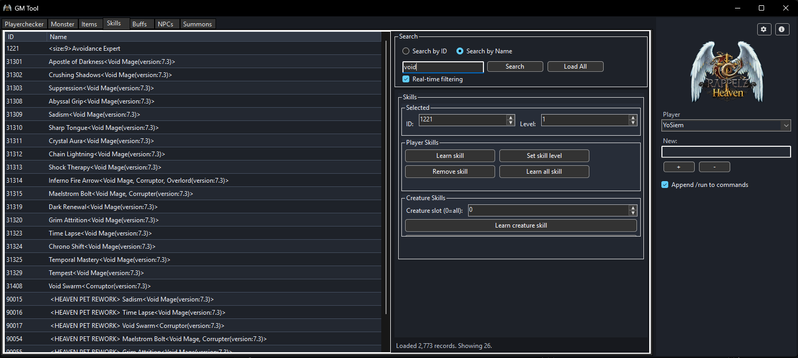
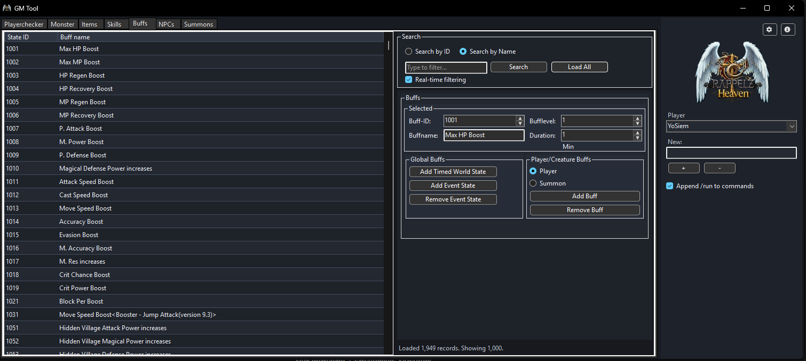
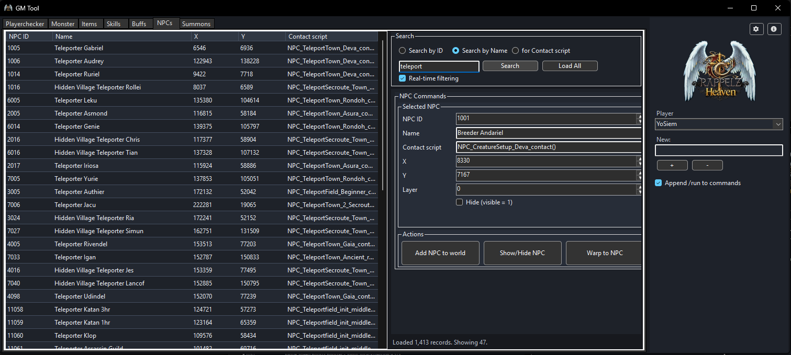
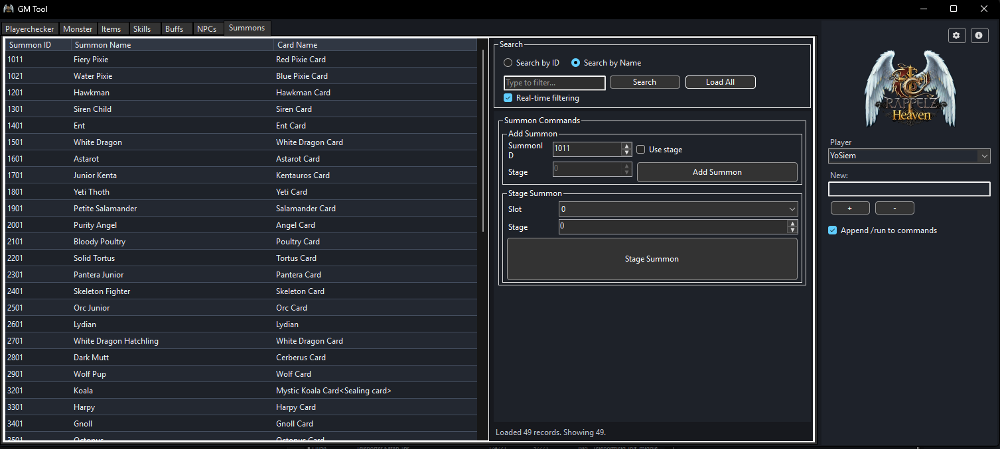

# YSM-GMTool

A Windows desktop GM utility for Rappelz private servers — browse game data, inspect player inventories/warehouses, and generate Lua commands directly to clipboard.

Built with Avalonia + ReactiveUI on .NET 10, with a native dark theme and fully async database access (MSSQL + MySQL).

---

## 🚀 Installation & Requirements

### Requirements

- **Windows 10 / 11** (x64)
- **.NET 10 Desktop Runtime** ([download](https://dotnet.microsoft.com/en-us/download/dotnet/10.0))
- Access to one of:
  - Microsoft SQL Server / Azure SQL
  - MySQL or MariaDB (compatible with MySqlConnector)
- Read access to the game database (Arcadia resources + Telecaster character/item data + Auth accounts)

### Installation

**Option A — Run from source**
```bash
git clone https://github.com/your-org/YSM-GMTool.git
cd YSM-GMTool
dotnet run --project src/App.Desktop/App.Desktop.csproj
```

**Option B — Clean publish (for distribution)**
```bash
pwsh scripts/publish-release.ps1 -PublishDir "C:\path\to\output\GM Tool"
```
*Publishes a framework-dependent win-x64 build (`GM Tool.exe`). The script wipes + recreates the
target folder and auto-kills any `GM Tool.exe` running from it. Without `-PublishDir` it defaults
to `%USERPROFILE%\Documents\YSMReleasedTools\GM-Tool\`. If publish fails on a file lock, close any
running `GM Tool.exe` launched from another folder and retry.*

---

## 🛠️ First-time Setup

1. Launch the application.
2. Click the **Settings** icon (top-right of the sidebar).
3. In the **Connection** tab:
   - Select provider: `MSSQL` or `MySQL`
   - Enter server, port, database, username, password
   - Click **Test Connection** to verify then click **OK** to save.
4. In the **Table Names** tab, fill in the token values that match your server's schema.



---

## 📦 Offline Snapshot Mode

The tool can run fully offline against a pre-baked snapshot file, with no live database connection.

### Producing a snapshot (admin)
1. Configure the tool against your live DB as usual.
2. Open **Settings → General**, click **Export Database to Snapshot…**
3. Save `gmtool-snapshot.db` next to `GM Tool.exe` (or anywhere; copy it there before shipping).
4. When prompted, also pack icons — produces `gmtool-icons.db` next to the snapshot.

### Using a snapshot (recipient)
Place `gmtool-snapshot.db` (and optionally `gmtool-icons.db`) next to `GM Tool.exe`. Launch — the app boots in offline mode automatically (window title shows "Offline Snapshot"). PlayerChecker, Inventory, and Warehouse features are hidden because they require a live DB; all browsing and Lua command generation works as in live mode.

---

## 🌟 Functionality & Features

### Playerchecker
Search characters by account name or character name. View ONLINE/OFFLINE status, load inventory, load warehouse, or open quick info.
- **SQL-level search** — queries run directly against the DB as you type (debounced).
- **Two search modes**: `by Account` or `by Char Name`.
- **Load Inventory / Warehouse** — inspect player items directly.



### Items
Browse all items. Give to yourself or other players, edit level/enhance/appearance/itemcode.



### Monster
Browse all monsters by name, ID, or location. Generate spawn commands.



### Skills
Browse skills. Learn, set level, remove — for yourself or another player.



### Buffs
Browse all buff/state records. Apply/remove buffs, world states, and event states.



### NPCs & Summons
Browse NPCs with contact script search. Generate add/show/warp commands. Browse summons and their card items to insert or stage summons.




### General Features & Quality of Life
- **Double-Click Export:** Double-clicking any cell inside a database datagrid instantly copies its string value to the OS clipboard.
- **In-Memory Limits Toggle:** Limit data-grid results strictly to 1000 items (via General Options tab) to ensure high-performance rendering while keeping the entire database subset fully searchable.
- **Real-time Filtering Toggle:** Choose between search-as-you-type debounced filtering, or exact Search button submissions.

### Command Generation & Sidebar
- Every action builds a Lua command (hardcoded builders in `src/App.Core/Commands/LuaCommands.cs`) and copies it to the clipboard.
- Optional `/run` prefix: when **Append /run to commands** is checked, the `/run ` prefix is added to all non-comment commands.
- Manage a list of target players (add/remove from the right sidebar) to use as targets for multi-player commands.

---

## ⚙️ Configuration

### SQL Queries — `src/App.Desktop/Config/queries.json`

Queries are grouped by provider (`MSSQL`, `MySQL`, and `Sqlite` for offline snapshots) and entity key. Tokens in `{{DoubleBraces}}` are replaced at runtime from Settings → Table Names.

| Token | Maps to |
|-------|---------|
| `{{ArcadiaName}}` | Resource database name |
| `{{TelecasterName}}` | Character/item database name |
| `{{AuthName}}` | Account database name |
| `{{StringResource}}` | String lookup table |
| `{{ItemResource}}` | Item resource table |
| `{{SkillResource}}` | Skill resource table |
| `{{StateResource}}` | State/buff resource table |
| `{{NpcResource}}` | NPC resource table |
| `{{SummonResource}}` | Summon resource table |
| `{{MonsterResource}}` | Monster resource table |

Parameterized queries use Dapper named parameters (`@SearchTerm`, `@OwnerId`, `@AccountName`).

### Lua Commands

Lua command strings are built in code (`src/App.Core/Commands/LuaCommands.cs`) — there is no external template file. Edit the builders and rebuild to change command shapes.

### Environment Variables (`.env`)

Place a `.env` file in the project root, app folder, or `%LocalAppData%\YSM-GMTool\`:

```env
YSM_DB_PROVIDER=MSSQL
YSM_DB_CONNECTION_STRING=Server=localhost;Database=ArcadiaDB;User Id=sa;Password=...;TrustServerCertificate=True
```

`.env` is gitignored.

---

## 📁 Application Data

| Data | Path |
|------|------|
| User settings | `%LocalAppData%\YSM-GMTool\settings.json` |
| Log files | `%LocalAppData%\YSM-GMTool\logs\gmtool-YYYYMMDD.log` |

---

## 🏗️ Project Structure

```
src/
  App.Core/         # Pure logic: models, abstractions, enums, Lua command builders, catalogs
  App.Data/         # Dapper repositories, DB connection factory, snapshot export
  App.Desktop/      # Avalonia UI: tabs (Features/*), shell, services, theme
    Config/
      queries.json  # SQL queries per provider and entity
```

---

## 💻 Tech Stack

| Component | Library |
|-----------|---------|
| UI framework | Avalonia 11 + ReactiveUI (.NET 10) |
| ORM | Dapper |
| SQL Server | Microsoft.Data.SqlClient |
| MySQL | MySqlConnector |
| Offline snapshot | Microsoft.Data.Sqlite |
| Logging | Serilog (file sink) |
| Icons | Projektanker.Icons.Avalonia (FontAwesome) |

---

## 🔧 Troubleshooting

| Problem | Solution |
|---------|----------|
| SQL Server certificate error | Add `TrustServerCertificate=True` to the connection string or use the Settings checkbox |
| Empty grid after searching | Verify provider, connection string, and token values in Settings → Table Names |
| PlayerChecker shows no results | Make sure `Telecaster Name` and `Arcadia Name` are set correctly; the queries are cross-database |
| Warehouse items not loading | Verify `Auth Name` token is set and the account table is accessible |
| Release publish fails (file lock) | Close any running `GM Tool.exe` launched from the publish folder, then re-run the publish script |
